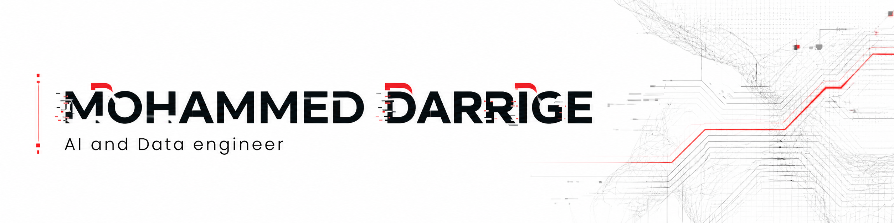
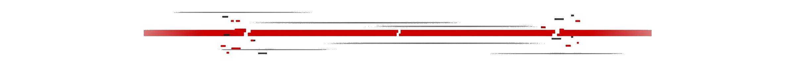

# Hi, I'm Mohammed Darrige
### AI & Data Engineering Student | Kaggle Notebooks Expert | ML / NLP / Computer Vision

  

## 🚀 About Me
My strongest foundation is in **Machine Learning and Deep Learning**, strengthened through consistent Kaggle notebook work and competition practice. I am now extending that core into newer product-style projects in Agentic AI and applied RAG.

- 🧠 **Core Strength:** Classical ML, model fundamentals, and deep learning experimentation.
- 📊 **Kaggle Snapshot:** Notebook work and competition experience.
- 🔭 **Current Focus:** Reliable ML demos, lightweight AI systems, and evaluation-aware LLM products.
- 🌱 **Currently Learning:** Agentic RAG, MLOps, and Causal Inference.
- 💬 **Ask me about:** ML pipelines, BERT/LSTM learning path, LoRA fine-tuning, and practical NLP systems.
- ⚡ **Fun Fact:** I balance my digital world by playing football and exploring art history through AI.

---

## 🛠 Tech Stack

### 🧠 AI & Machine Learning

### 🏗 Infrastructure & Backend

---

## 📚 Kaggle Highlights

- **Role:** Notebooks Expert (`1,442 / 61,182`)
- **Output:** Public notebooks, competitions, and active discussion contributions
- **Popular notebooks:**
  - [Movie_Recommender_System_Content_Based](https://www.kaggle.com/code/muhammedderric/movie-recommender-system-content-based)
  - [NLP_Course_Level_4_LLM_RAG](https://www.kaggle.com/code/muhammedderric/nlp-course-level-4-llm-rag)
  - [NLP_Course_Level_3_BERT.ipynb](https://www.kaggle.com/code/muhammedderric/nlp-course-level-3-bert-ipynb)
- **Profile:** [kaggle.com/muhammedderric](https://www.kaggle.com/muhammedderric)

---

## 🌟 Current Build Projects

I am actively turning my ML/DL foundation into production-facing systems through the projects below.

### 🎨 [Neural Style Transfer Lab](https://github.com/Mohammed-Darrige/neural-style-transfer)
**Fine-tuned LoRA engine for artistic reimagination.**
- **The Core:** Fine-tuned SD 1.5 using LoRA adapters for 4 specific art styles (Cubism, Pop Art, Post-Impressionism, Ukiyo-e).
- **Technology:** Python, PyTorch, Diffusers, FastAPI.
- **Impact:** Achieved high-fidelity style injection with minimal adapter size (~6MB), integrated into a live Next.js laboratory.

### 🦁 [AI Akinator](https://github.com/Mohammed-Darrige/ai-akinator)
**Agentic animal deduction engine with server-validated reasoning.**
- **The Core:** Uses a "Constraint Ledger" and information-gain-based questioning to predict animals in minimal steps.
- **Technology:** Python, FastAPI, Pydantic, LLM Integration.
- **Impact:** Eliminates typical LLM hallucinations through strict state management and rule validation.

### 📊 [Artoria Dataset](https://www.kaggle.com/datasets/h7alasaleh/artoria-dataset)
**Custom curated dataset for art-style classification and generative training.**
- **The Core:** A high-quality collection of art movements used to train the Neural Style Transfer Lab.

---

## 📈 Github Stats

  
  

---

## 📫 Connect with Me

---

<i>"Building the future, one node at a time."</i>

